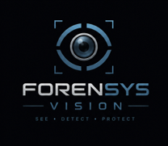

# 🔬 ForenSys Vision

<p align="center">
  
</p>

<p align="center">
  <strong>Sistema de Inteligencia Forense Digital</strong><br>
  Reconocimiento facial · Reconocimiento de placas · Geolocalización · Rutas · Reportes
</p>

<p align="center">
  <a href="https://github.com/AndresGonzalezDev444/ForenSys-Vision">
    
  </a>
  
  
  
  
  
</p>

---

## 🧠 ¿Qué es ForenSys Vision?

**ForenSys Vision V2** es un sistema de inteligencia forense digital desarrollado como **proyecto de grado**, orientado a integrar diferentes herramientas de análisis visual, biométrico y geoespacial dentro de una misma aplicación web.

El proyecto combina un backend en **Python + FastAPI**, una base de datos **SQLite gestionada mediante SQLAlchemy** y una interfaz web desarrollada con **HTML5, CSS3 y JavaScript**.

Su propósito es centralizar procesos de:

```text
📷 Captura / video
        ↓
🧠 Análisis visual
        ↓
🧬 Identificación biométrica
        ↓
🚘 Identificación vehicular
        ↓
📍 Geolocalización
        ↓
🗺️ Reconstrucción de rutas
        ↓
🚨 Alertas
        ↓
📄 Reporte pericial
```

El proyecto se encuentra planteado para **entornos académicos, de laboratorio e investigación autorizada**.

---

# 🎯 Objetivo

ForenSys Vision busca demostrar cómo diferentes tecnologías de **Computer Vision, reconocimiento biométrico, OCR, geolocalización y desarrollo web** pueden integrarse en una plataforma única para apoyar el análisis de escenarios de investigación digital.

La versión V2 integra:

- 🧬 Reconocimiento facial en tiempo real.
- 🚘 Reconocimiento de placas vehiculares.
- 🗺️ Trazado de rutas forense.
- 📍 Geolocalización del dispositivo.
- 🚨 Registro de alertas.
- 👤 Gestión de sujetos.
- 📷 Gestión de fotografías faciales.
- 📄 Generación de reportes periciales.
- 🗃️ Exportación e importación de la base de datos.
- 🔐 Autenticación de usuarios.

---

# ✨ Funcionalidades

## 🧬 1. Reconocimiento facial en tiempo real

El módulo de reconocimiento facial permite trabajar con una **cámara local o una fuente IP/URL**.

El backend expone un streaming de video para el procesamiento en vivo y permite detectar automáticamente sujetos registrados en la base de datos.

Tecnologías indicadas por la interfaz:

```text
OpenCV
YuNet
LBPH
MJPEG
```

El flujo general es:

```text
🎥 Cámara local / IP
        ↓
🖼️ Frames
        ↓
🔍 Detección facial
        ↓
🧠 Reconocimiento
        ↓
👤 Comparación con sujetos registrados
        ↓
🚨 Posible alerta / evento
```

El backend admite fuentes locales y URLs `rtsp://`, `http://` y `https://` para el módulo de video.
---

# 🚘 2. Reconocimiento de placas

ForenSys Vision incorpora un módulo ANPR orientado a la detección y lectura de **placas vehiculares colombianas**.

La interfaz contempla dos motores:

### 🟠 OCR clásico — Offline

Utiliza:

- EasyOCR
- OpenCV
- Canny
- ANPR

Está orientado a funcionar localmente una vez cargados los modelos de EasyOCR.

### 🔵 YOLO IA — Roboflow

El segundo motor utiliza:

- YOLOv8
- Roboflow
- Bounding Boxes
- API en la nube

La propia interfaz identifica el modelo como `proyecto-placas-8arfj` y diferencia entre el procesamiento OCR local y el procesamiento YOLO mediante API.

Formatos contemplados por la interfaz:

```text
ABC-123
AB-1234
```

---

# 📍 3. Geolocalización

La interfaz incorpora un panel de **ubicación** con:

- Coordenadas.
- Precisión GPS.
- Timestamp.

También utiliza la geolocalización dentro de la generación de reportes periciales.

El reporte registra la ubicación proporcionada por el sistema y la hora en la que se genera el documento.
---

# 🗺️ 4. Trazador de rutas forense

Este módulo permite reconstruir y visualizar trayectorias mediante un mapa interactivo.

Tecnologías utilizadas:

- Leaflet.js
- OpenStreetMap
- OpenRouteService (ORS)

El backend recibe una lista de puntos:

```json
{
  "waypoints": [
    [lat, lng],
    [lat, lng],
    [lat, lng]
  ],
  "alternatives": 3
}
```

y devuelve las rutas calculadas en **GeoJSON**.

Actualmente el backend admite entre **1 y 5 rutas alternativas**.

### 🔐 Configuración de OpenRouteService

El módulo de rutas utiliza una API Key cargada desde:

```text
config.py
```

con la variable:

```python
ORS_API_KEY = "TU_API_KEY"
```

Si `config.py` no existe o no contiene la clave, el módulo de rutas no podrá realizar los cálculos.

> **Nunca publiques tu API Key en GitHub.** Mantén `config.py` fuera del control de versiones o utiliza una estrategia de variables de entorno.

---

# 🚨 5. Sistema de alertas

ForenSys Vision mantiene un registro de alertas asociado a los sujetos.

Cada alerta puede almacenar:

```text
🕒 Timestamp
👤 Sujeto
🔎 Tipo de detección
📍 Ubicación
📝 Detalles
```

La estructura de base de datos incluye una entidad `Alert` relacionada con `Suspect`.

Estas alertas también pueden aparecer posteriormente en los reportes periciales generados por el sistema.

---

# 👤 6. Gestión de sujetos

La aplicación incluye un CRUD para administrar sujetos registrados.

Cada sujeto puede almacenar:

- Nombre.
- Apellido.
- Identificación.
- Perfil de conducta.
- Fotografía principal.
- Huella dactilar.
- Fotografías faciales asociadas.

Las fotografías faciales también almacenan el ángulo de captura y la fecha de creación.

El backend permite:

```text
POST    /api/suspects
GET     /api/suspects
GET     /api/suspects/{id}
PUT     /api/suspects/{id}
DELETE  /api/suspects/{id}
```

Además, después de agregar o eliminar fotografías, el proyecto ejecuta un proceso de reentrenamiento del modelo facial.

---

# 📸 7. Captura y almacenamiento de fotografías

Las fotografías faciales pueden recibirse mediante:

- 📁 Upload de archivo.
- 📷 Captura desde webcam.
- 🧾 Imagen codificada en Base64.

El sistema las almacena en:

```text
static/faces/
```

y relaciona cada fotografía con el sujeto correspondiente.

También permite registrar diferentes ángulos:

```text
front
left_profile
right_profile
semi_profile
```

---

# 📄 8. Generación de reportes periciales

ForenSys Vision genera un **reporte pericial en HTML** desde el backend.

El reporte puede incluir:

- Número de caso.
- Investigador.
- Fecha y hora.
- Sujetos analizados.
- Geolocalización.
- Historial de alertas.
- Observaciones del investigador.

El documento se genera automáticamente y se entrega como archivo HTML.

La interfaz lo presenta como un documento preparado para documentación forense y posterior impresión/exportación desde el navegador.

### 🧾 Estructura del reporte

```text
┌────────────────────────────────────────┐
│         FORENSYS VISION V2             │
│      REPORTE PERICIAL FORENSE          │
├────────────────────────────────────────┤
│ Número de Caso                         │
│ Investigador                            │
│ Fecha / Hora                            │
│ Sujetos analizados                     │
├────────────────────────────────────────┤
│ 📍 Geolocalización                      │
├────────────────────────────────────────┤
│ 👤 Sujetos investigados                 │
├────────────────────────────────────────┤
│ 🚨 Historial de alertas                 │
├────────────────────────────────────────┤
│ 📝 Observaciones                        │
└────────────────────────────────────────┘
```

---

# 🗃️ 9. Base de datos

El proyecto utiliza:

**SQLite + SQLAlchemy**

La base de datos configurada actualmente es:

```text
ciberforense.db
```

con la conexión:

```text
sqlite:///./ciberforense.db
```

SQLAlchemy se utiliza como ORM para manejar las entidades del sistema.

### Entidades principales

```text
User
 │
 └── usuarios / roles

Suspect
 │
 ├── FacePhoto
 │
 └── Alert
```

La estructura actual contempla usuarios, sujetos, fotografías faciales y alertas.

---

# 🔐 10. Autenticación

La aplicación incorpora autenticación con:

- OAuth2 Password Bearer.
- Bcrypt para contraseñas.
- Roles de usuario.

El backend expone:

```text
POST /api/login
```

para el inicio de sesión.

### ⚠️ Credenciales iniciales

El código actual crea automáticamente un usuario administrativo de desarrollo:

```text
Usuario: admin
Contraseña: admin123
```

Esto está definido directamente en el código de startup. **Debe cambiarse antes de utilizar el sistema en un entorno real.**

---

# 💾 11. Importación y exportación de la base de datos

La plataforma incluye endpoints para:

```text
📤 Exportar ciberforense.db
📥 Importar ciberforense.db
```

Endpoints:

```text
GET  /api/database/export
POST /api/database/import
```

Esto permite transportar una base de datos de laboratorio o realizar respaldos del estado del sistema.

---

# 🧱 Arquitectura

```text
                         🌐 BROWSER
                             │
                             ▼
                  ┌─────────────────────┐
                  │ HTML5 / CSS3 / JS  │
                  │ Dashboard + Modules │
                  └──────────┬──────────┘
                             │
                             ▼
                    ┌─────────────────┐
                    │     FastAPI     │
                    │      API V2     │
                    └────────┬────────┘
                             │
          ┌──────────────────┼──────────────────┐
          │                  │                  │
          ▼                  ▼                  ▼
       🧬 Vision          🚘 Plates          🗺️ Routes
       OpenCV             EasyOCR            ORS
       YuNet              Canny              Leaflet
       LBPH               YOLOv8             OSM
          │                  │                  │
          └──────────────────┼──────────────────┘
                             ▼
                    ┌─────────────────┐
                    │   SQLAlchemy    │
                    └────────┬────────┘
                             ▼
                         🗃️ SQLite
```

---

# 🛠️ Tecnologías utilizadas

| Tecnología | Uso |
|---|---|
| 🐍 **Python 3** | Lenguaje principal |
| ⚡ **FastAPI** | Backend / API |
| 🚀 **Uvicorn** | Servidor ASGI |
| 🔐 **OAuth2 + Bcrypt** | Autenticación |
| 🖥️ **HTML5 / CSS3 / JavaScript** | Interfaz web |
| 👁️ **OpenCV** | Computer Vision |
| 🧠 **YuNet** | Detección facial |
| 🧬 **LBPH** | Reconocimiento facial |
| 🔤 **EasyOCR** | Lectura de placas |
| 🤖 **YOLOv8 / Roboflow** | Detección de placas mediante IA |
| 🗺️ **Leaflet.js** | Mapa interactivo |
| 🌍 **OpenStreetMap** | Cartografía |
| 🧭 **OpenRouteService** | Cálculo de rutas |
| 🗃️ **SQLite** | Base de datos |
| 🧩 **SQLAlchemy** | ORM |
| 📐 **Pydantic** | Esquemas/validación |
| 🔌 **httpx** | Comunicación HTTP |
| 🔢 **NumPy** | Operaciones numéricas |
| 🌐 **WebSockets** | Comunicación en tiempo real |
| 🧪 **scikit-learn** | Componentes de análisis/modelado |
| 📷 **MJPEG** | Streaming de video |

La interfaz del proyecto identifica explícitamente Python/FastAPI, OpenCV + YuNet + LBPH, EasyOCR, Leaflet/OpenStreetMap, SQLAlchemy/SQLite y HTML/CSS/JavaScript como parte de la V2.

---

# 📦 Requisitos

- Windows, Linux o un entorno Python compatible.
- Python 3.x.
- `pip`.
- Cámara local o fuente IP para módulos de video.
- Conexión a Internet para servicios externos como OpenRouteService y, en el modo correspondiente, Roboflow.
- Una API Key de OpenRouteService para el trazador de rutas.

Para OCR con EasyOCR, la primera ejecución puede descargar aproximadamente **400 MB de modelos** según la información mostrada en la interfaz.

---

# 🚀 Instalación

## 1. Clonar el repositorio

```bash
git clone https://github.com/AndresGonzalezDev444/ForenSys-Vision.git
cd ForenSys-Vision
```

---

## 2. Crear el entorno virtual

### Windows

```bash
python -m venv venv
venv\Scripts\activate
```

### Linux / Kali

```bash
python3 -m venv venv
source venv/bin/activate
```

---

## 3. Instalar dependencias

El repositorio incluye un script:

```text
setup.bat
```

que crea el entorno virtual y actualmente instala:

```text
fastapi
uvicorn[standard]
sqlalchemy
opencv-contrib-python
scikit-learn
websockets
jinja2
python-multipart
numpy
bcrypt
easyocr
httpx
pygrabber
```

Puedes ejecutar:

```text
setup.bat
```

desde Windows.

---

# ⚙️ Configuración

## OpenRouteService

Crea un archivo local:

```text
config.py
```

con:

```python
ORS_API_KEY = "TU_API_KEY"
```

No publiques este archivo ni tu clave en GitHub.

---

# ▶️ Ejecución

## Windows — opción rápida

Después de configurar el entorno:

```text
iniciar.bat
```

El script ejecuta:

```text
venv\Scripts\python main.py
```


---

## Ejecución manual

Con el entorno virtual activado:

```bash
python main.py
```

El backend inicia Uvicorn en:

```text
http://127.0.0.1:8000
```

El propio `main.py` configura ese host y puerto cuando se ejecuta directamente.
---

# 📚 Documentación de la API

FastAPI genera automáticamente documentación interactiva.

Con el servidor iniciado:

```text
http://127.0.0.1:8000/docs
```

Documentación alternativa:

```text
http://127.0.0.1:8000/redoc
```

---

# 🔌 Endpoints principales

| Método | Endpoint | Función |
|---|---|---|
| `POST` | `/api/login` | Autenticación |
| `GET` | `/api/cameras` | Listar cámaras locales |
| `GET` | `/api/video_feed` | Streaming facial |
| `POST` | `/api/video_stop` | Detener streaming facial |
| `GET` | `/api/plate_video_feed` | Streaming de placas OCR |
| `POST` | `/api/plate_video_stop` | Detener OCR |
| `GET` | `/api/plate_roboflow_feed` | Streaming de placas YOLO/Roboflow |
| `POST` | `/api/plate_roboflow_stop` | Detener YOLO |
| `GET` | `/api/suspects` | Listar sujetos |
| `POST` | `/api/suspects` | Crear sujeto |
| `PUT` | `/api/suspects/{id}` | Actualizar sujeto |
| `DELETE` | `/api/suspects/{id}` | Eliminar sujeto |
| `POST` | `/api/suspects/{id}/photo` | Subir foto facial |
| `POST` | `/api/suspects/{id}/photo_base64` | Registrar captura Base64 |
| `GET` | `/api/suspects/{id}/photos` | Consultar fotos |
| `DELETE` | `/api/photos/{id}` | Eliminar foto |
| `POST` | `/api/routes/calculate` | Calcular rutas |
| `POST` | `/api/report/generate` | Generar reporte |
| `GET` | `/api/database/export` | Exportar BD |
| `POST` | `/api/database/import` | Importar BD |

Estos endpoints están definidos en el backend actual del proyecto.

---

# 🧪 Casos de uso

## 🎓 1. Laboratorio académico

ForenSys Vision puede utilizarse para estudiar la integración de:

```text
Python
│
├── FastAPI
├── Computer Vision
├── OCR
├── Machine Learning
├── APIs
├── Bases de datos
└── Geolocalización
```

---

## 🔎 2. Investigación forense simulada

Un escenario de laboratorio puede seguir este flujo:

```text
🎥 Fuente de video
       ↓
🧬 Reconocimiento facial
       ↓
👤 Identificación
       ↓
🚨 Registro de alerta
       ↓
📍 Ubicación
       ↓
🗺️ Reconstrucción de ruta
       ↓
📄 Reporte pericial
```

---

## 🚗 3. Análisis vehicular

El módulo de placas permite experimentar con:

```text
Cámara
  ↓
Detección
  ↓
Localización de placa
  ↓
OCR / YOLO
  ↓
Lectura del texto
```

---

## 🧪 4. Pruebas de Computer Vision

El proyecto también funciona como entorno experimental para comparar diferentes estrategias:

```text
Reconocimiento facial
      │
      ├── YuNet
      └── LBPH

Reconocimiento de placas
      │
      ├── OpenCV + Canny + EasyOCR
      └── YOLOv8 + Roboflow
```

---

# 📁 Estructura del proyecto

```text
ForenSys-Vision/
│
├── 🐍 main.py
├── 🗃️ database.py
├── 🧱 models.py
├── 📐 schemas.py
│
├── 🧠 ml_models/
│   ├── facial_recognition.py
│   ├── plate_recognition.py
│   └── plate_roboflow.py
│
├── 🌐 static/
│   ├── index.html
│   └── faces/
│
├── 🔬 forensys-vision.png
├── ▶️ iniciar.bat
├── ⚙️ setup.bat
└── 🚫 .gitignore
```

Los módulos de visión son referenciados directamente desde `main.py`; la estructura anterior representa esa organización funcional.

---

# 🔒 Seguridad y privacidad

ForenSys Vision trabaja con datos biométricos, fotografías, ubicaciones y registros de investigación.

Por eso:

- ❌ No publiques fotografías reales de personas.
- ❌ No publiques bases de datos reales.
- ❌ No compartas API Keys.
- ❌ No utilices el sistema contra personas, vehículos o infraestructuras sin autorización.
- ✅ Utiliza datos sintéticos o de laboratorio.
- ✅ Protege las credenciales.
- ✅ Cambia las credenciales de desarrollo antes de cualquier despliegue.
- ✅ Respeta la legislación de protección de datos y privacidad aplicable.

Este proyecto está planteado como herramienta de **uso académico, experimental e investigativo autorizado**.

---

# ⚠️ Estado del proyecto

**ForenSys Vision V2** se encuentra en desarrollo y forma parte de una plataforma más amplia denominada **ForenSys**.

La versión actual concentra principalmente:

```text
✅ Reconocimiento facial
✅ Reconocimiento de placas
✅ Geolocalización
✅ Trazado de rutas
✅ Alertas
✅ Gestión de sujetos
✅ Reportes periciales
✅ Base de datos
✅ Autenticación
```

El propio apartado "Acerca del Proyecto" identifica la aplicación como **ForenSys Vision V2** y la describe como un proyecto de grado que integra reconocimiento facial y de placas en tiempo real, trazado de rutas geoespaciales, generación de reportes y geolocalización persistente.

---

# 🔭 Roadmap

```text
                    FORENSYS
                       │
              ┌────────┴────────┐
              │                 │
         ForenSys Lab      ForenSys Vision
                                │
                    ┌───────────┼───────────┐
                    │           │           │
                  Facial      Plates      Routes
                    │           │           │
                    └───────────┼───────────┘
                                │
                          Reports + Alerts
                                │
                                ▼
                         Digital Forensics
```

Posibles líneas de evolución:

- 📹 Integración de más fuentes de video.
- 🧬 Mejora de modelos biométricos.
- 🚘 Ampliación del reconocimiento vehicular.
- 🗺️ Reconstrucción espacial más avanzada.
- 📊 Analítica histórica de detecciones.
- 📄 Exportación documental adicional.
- 🔐 Fortalecimiento de autenticación y control de acceso.
- 🧪 Herramientas adicionales de laboratorio forense.

---

# 👨‍💻 Autor

## Andres Gonzalez Dev

**Robinson Andrés González Quintero**

💻 Desarrollo de Software · Fullstack · Sistemas · Ciberseguridad

🌐 **Página web:**  
https://andresgonzalezdev.me

🐙 **GitHub:**  
https://github.com/AndresGonzalezDev444

---

<p align="center">
  
</p>

<p align="center">
  <strong>FORENSYS VISION V2</strong><br>
  <em>SEE · DETECT · PROTECT</em>
</p>

---

## ⚖️ Disclaimer

ForenSys Vision es un proyecto de carácter **académico, experimental e investigativo**.

Las funciones de reconocimiento facial, reconocimiento de placas, geolocalización y generación de información relacionada con personas deben utilizarse únicamente en escenarios autorizados y de conformidad con la legislación y las políticas aplicables.

El sistema no debe considerarse un sustituto de procedimientos periciales, judiciales o institucionales profesionales.

---

<p align="center">

⭐ Si te interesa el proyecto, puedes visitar el repositorio y apoyar su desarrollo.

</p>
